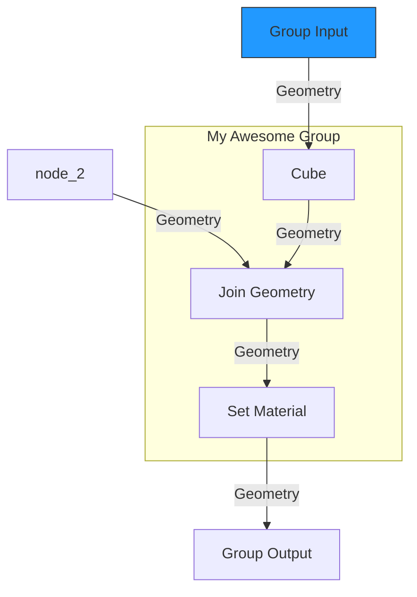

## Geometry Nodes Tree to Mermaid

このBlenderアドオンは、アクティブなオブジェクトの**ジオメトリノードツリー**を、Markdownで表示可能な**Mermaidグラフ**としてエクスポートします。

ノードの複雑な接続を視覚的に整理し、他のユーザーと共有するのに役立ちます。

-----

## 主な機能

  - **Mermaidグラフ生成**: ジオメトリノードの接続を、テキストベースのフローチャートとして出力します。
  - **フレームのサブグラフ化**: ジオメトリノードのフレームは、Mermaidのサブグラフとして自動的にグループ化されます。
  - **ノードのカスタマイズ**: カスタムカラーが設定されたノードは、Mermaidグラフにもその色が反映されます。
  - **クリーンな出力**: リンクされていないノードは自動的に除外されるため、グラフがすっきりと見やすくなります。
  - **ファイル出力**: `.md`または`.html`形式で、生成されたコードを直接ファイルに保存できます。

-----

## インストール方法

1.  `geometry_nodes_to_mermaid_export.py`をダウンロードします。
2.  Blenderを開き、**`編集`** \> **`プリファレンス`** \> **`アドオン`** に移動します。
3.  **`インストール...`** ボタンをクリックし、ダウンロードした`geometry_nodes_to_mermaid_export.py`ファイルを選択します。
4.  アドオンリストから **`Export Geometry Nodes Tree`** を探し、チェックボックスをオンにして有効化します。

-----

## 使い方

1.  ジオメトリノードがアタッチされたオブジェクトを選択します。
2.  Blenderのビューポートで `F3` キー（または `スペースバー`）を押し、Blenderの検索機能を開きます。
3.  検索バーに **`Export Geometry Nodes`** と入力し、表示されるオペレーターをクリックします。
4.  ファイル保存ダイアログが表示されるので、出力先のパスとファイル名を指定します。
5.  ファイル名のすぐ下にあるドロップダウンメニューから、**`Markdown (.md)`** または **`HTML (.html)`** を選択して **`Export`** ボタンをクリックします。

-----

## 出力例

以下のMermaidグラフは、実際のジオメトリノードツリーから生成されます。

